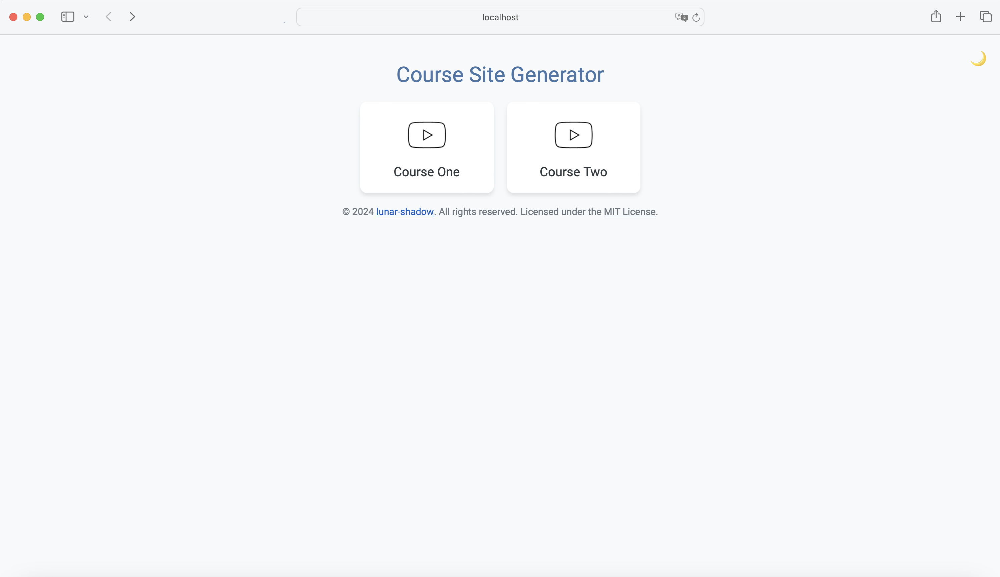
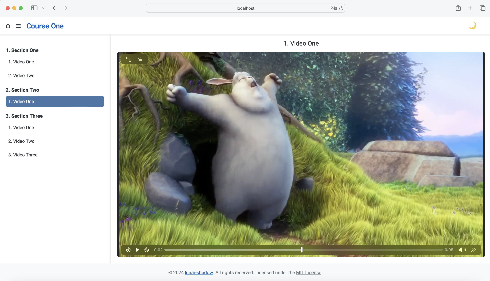

# Course Site Generator
This project enables you to create a local website for organizing and viewing your video courses. It generates an HTML site with structured sections and video playlists based on your directory's organization of course files.

## Screenshots
Here are some screenshots of how the site shows up.

### Homepage 


### Course Pages



## Setup via installer in one step
Run the installer in your course directory:

```
curl -sL https://gist.githubusercontent.com/lunar-shadow/ace57d73f501e27f023ca9c0915c38b1/raw/f55afae19e27e372e5a3ff592e28209001fe6650/install.sh | sh
```

## Setup from the repository

1. **Clone the Repository**: Clone this repository to your local machine.

2. **Prepare Your Course Files**: Organize your video files into sections within a directory. Ensure that the directory structure follows the correct numbering format (e.g., "1. Section - One", "2. Section - Two", etc.), and each video file is numbered accordingly (e.g., "1. Video One.mp4", "2. Video Two.mp4", etc.).

3. **Generate the Course Site**: Run the start_service.py script to generate the HTML site. This script will automatically create an index.html file based on your organized course files.

```shell
❯ python start_service.py
Generated site_generator/generated_html/index.html successfully.
Course site generated successfully with 2 courses.
Select the browser you want to use:
1. Default (Safari on Mac OS / Edge on Windows)
2. Brave
3. Google Chrome
4. Firefox
Choose a browser to open: 
```

## License

This project is licensed under [MIT License](LICENSE.txt). 
https://opensource.org/license/mit
